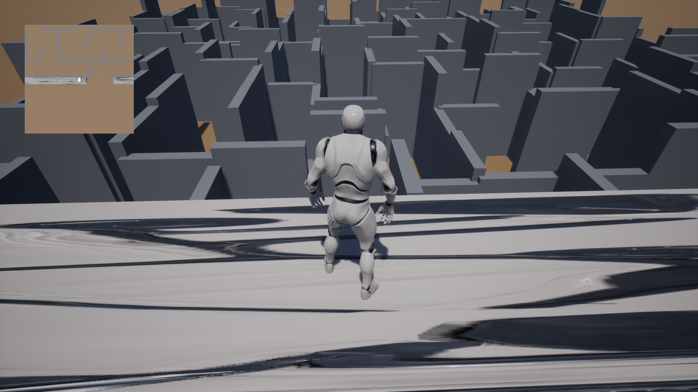
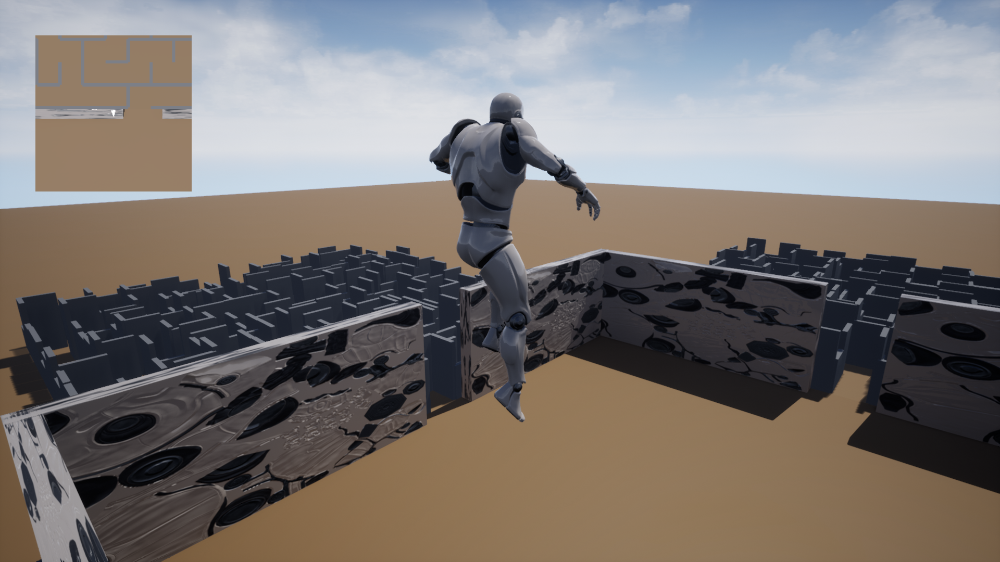

# MazeGenerator
Explored the Recursive Implementation algorithm to create a maze in Unreal using C++.

Recursive Implementation: [here](https://en.wikipedia.org/wiki/Maze_generation_algorithm)

The game design ideia was inspired from the movie Maze Runner.

